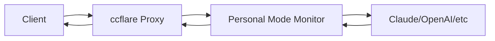

# Personal Mode LLM Monitor: Expansion Plan

## Current Session Management Analysis

### Current Implementation Issues
The existing session logic in [`personal_mode_llm_monitor.ts:80-97`](packages/personal-mode-monitor/src/personal_mode_llm_monitor.ts:80-97) uses simple time-based windows:

```typescript
// Current approach - too simplistic
private extractSessionId(request: Request): string {
  const timestamp = Math.floor(Date.now() / (5 * 60 * 1000)); // 5-minute windows
  return `session-${this.hashString(sessionData)}`;
}
```

**Problems:**
- No semantic understanding of conversation topics
- Can't handle multiple simultaneous conversations
- Loses context when conversations resume later
- No conversation thread identification

## Phase 1: Enhanced Session Management (Immediate - Lightweight)

### 1.1 Conversation Thread Detection
**Goal**: Identify conversation threads without embedding infrastructure

**Implementation Plan:**
```typescript
// New session detection logic
interface ConversationThread {
  threadId: string;
  topic: string; // extracted from first message
  lastActivity: number;
  messageCount: number;
  participants: string[];
}

class ThreadDetector {
  // Simple keyword-based topic extraction
  extractTopic(content: string): string {
    // Look for explicit topics: "help me with X", "I need to Y"
    // Extract nouns and action verbs
    // Maximum 50 chars topic summary
  }
  
  // Detect thread continuation
  isThreadContinuation(newMessage: string, existingThreads: ConversationThread[]): string | null {
    // Check for explicit references: "continuing from earlier", "back to the X topic"
    // Look for shared vocabulary/concepts
    // Check timing patterns (same user, reasonable gap)
  }
}
```

### 1.2 Database Schema Enhancement
**New Tables:**
```sql
CREATE TABLE conversation_threads (
  thread_id TEXT PRIMARY KEY,
  user_id TEXT NOT NULL,
  topic TEXT NOT NULL,
  created_at INTEGER NOT NULL,
  last_activity INTEGER NOT NULL,
  message_count INTEGER DEFAULT 0,
  status TEXT DEFAULT 'active' -- active, paused, closed
);

CREATE TABLE thread_messages (
  message_id TEXT PRIMARY KEY,
  thread_id TEXT NOT NULL,
  interaction_id TEXT NOT NULL, -- FK to personal_interactions
  sequence_order INTEGER NOT NULL,
  FOREIGN KEY (thread_id) REFERENCES conversation_threads(thread_id),
  FOREIGN KEY (interaction_id) REFERENCES personal_interactions(id)
);
```

### 1.3 Session Bridging Logic
```typescript
class SessionBridger {
  // Resume conversations after gaps
  findResumableThreads(userId: string, content: string): ConversationThread[] {
    // Look for threads paused in last 7 days with topic similarity
    // Check for explicit continuation signals
    // Score by topic relevance and timing
  }
  
  // Handle concurrent conversations
  detectConcurrentThreads(userId: string): ConversationThread[] {
    // Multiple active threads for same user
    // Different topics/contexts running simultaneously
  }
}
```

## Phase 2: Multi-Endpoint Capture Architecture

### 2.1 Current Architecture Analysis
The system works as a **proxy interceptor** - all traffic flows through ccflare proxy first:



### 2.2 OpenRouter Integration Plan

**Step 1: Provider Detection Enhancement**
```typescript
// Enhanced provider detection in integration.ts
class ProviderDetector {
  detectEndpoint(request: Request, url: URL): EndpointInfo {
    // Current: only anthropic.com
    // Add: openrouter.ai, openai.com, etc.
    
    if (url.hostname.includes('openrouter.ai')) {
      return {
        provider: 'openrouter',
        finalDestination: this.extractOpenRouterModel(request),
        apiType: 'chat-completions'
      };
    }
    
    if (url.hostname.includes('api.openai.com')) {
      return { provider: 'openai', finalDestination: 'openai-direct' };
    }
  }
  
  extractOpenRouterModel(request: Request): string {
    // Parse request body to get model (e.g., "anthropic/claude-3-sonnet")
    // Return actual model being used, not just "openrouter"
  }
}
```

**Step 2: New Database Fields**
```sql
ALTER TABLE personal_interactions ADD COLUMN provider TEXT DEFAULT 'claude';
ALTER TABLE personal_interactions ADD COLUMN endpoint_destination TEXT;
ALTER TABLE personal_interactions ADD COLUMN routing_path TEXT; -- openrouter -> anthropic/claude-3
```

**Step 3: Multi-Provider Request Tracking**
```typescript
interface EnhancedInteraction extends PersonalInteraction {
  provider: string; // 'claude', 'openrouter', 'openai'
  endpointDestination: string; // Final model/service
  routingPath: string; // How request was routed
  intermediateServices: string[]; // Any proxy chains
}
```

### 2.3 Universal LLM Capture System

**Configuration-Driven Approach:**
```typescript
interface ProviderConfig {
  name: string;
  hostPatterns: string[];
  pathPatterns: string[];
  modelExtractor: (request: Request) => string;
  tokenExtractor: (response: Response) => TokenUsage;
  costCalculator: (tokens: TokenUsage, model: string) => number;
}

const PROVIDER_CONFIGS: ProviderConfig[] = [
  {
    name: 'openrouter',
    hostPatterns: ['openrouter.ai'],
    pathPatterns: ['/api/v1/chat/completions'],
    modelExtractor: (req) => extractFromBody(req, 'model'),
    // ... more configs
  },
  // Add new providers by configuration
];
```

## Phase 3: Data Analysis & Storage Optimization

### 3.1 Content Analysis Pipeline
**Goal**: Extract insights and reduce storage without losing important information

```typescript
interface ConversationSummary {
  thread_id: string;
  summary: string; // AI-generated summary of key points
  topics: string[]; // Extracted topics/themes
  decisions_made: string[]; // Decisions or conclusions reached
  action_items: string[]; // Tasks or follow-ups identified
  code_changes: string[]; // Files/code discussed
  learning_insights: string[]; // New concepts learned
}

class ContentAnalyzer {
  // Periodic analysis (nightly?)
  async analyzeAndSummarize(threadId: string): Promise<ConversationSummary> {
    const messages = await this.getThreadMessages(threadId);
    
    // Use local LLM or lightweight analysis
    return {
      summary: await this.generateSummary(messages),
      topics: this.extractTopics(messages),
      decisions_made: this.extractDecisions(messages),
      action_items: this.extractActionItems(messages),
      code_changes: this.extractCodeReferences(messages),
      learning_insights: this.extractLearningMoments(messages)
    };
  }
}
```

### 3.2 Storage Lifecycle Management
```typescript
class StorageManager {
  // 3-tier storage approach
  
  // Tier 1: Hot storage (recent, frequently accessed)
  // - Full conversation content
  // - Last 30 days
  
  // Tier 2: Warm storage (summarized)
  // - Conversation summaries + key excerpts
  // - 30 days - 1 year
  
  // Tier 3: Cold storage (archives)
  // - High-level summaries only
  // - Key decisions and insights
  // - 1+ years
  
  async promoteToSummary(threadId: string) {
    const summary = await this.contentAnalyzer.analyzeAndSummarize(threadId);
    await this.archiveFullContent(threadId);
    await this.storeSummary(summary);
  }
}
```

### 3.3 Qdrant Integration (Future Phase)
**Preparation for Semantic Search:**
```typescript
interface QdrantConfig {
  enabled: boolean;
  endpoint: string;
  collection: string;
  embeddingModel: string; // e.g., 'all-MiniLM-L6-v2'
}

class SemanticSessionManager {
  // Vector-based conversation similarity
  async findSimilarConversations(content: string): Promise<ConversationThread[]> {
    // Generate embedding for new content
    // Search Qdrant for similar conversation vectors
    // Return ranked list of related threads
  }
  
  // Automatic conversation clustering
  async clusterConversations(userId: string): Promise<ConversationCluster[]> {
    // Group related conversations by semantic similarity
    // Identify recurring topics and patterns
  }
}
```

## Implementation Timeline & Priority

### Phase 1: Enhanced Session Management (Sprint 1-2)
- [ ] Implement conversation thread detection
- [ ] Add new database tables for threads
- [ ] Create session bridging logic
- [ ] Add topic extraction
- [ ] Test with multi-day conversations

### Phase 2: Multi-Endpoint Capture (Sprint 3-4)
- [ ] Add OpenRouter provider detection
- [ ] Enhance database schema for multi-provider
- [ ] Implement provider-agnostic request/response parsing
- [ ] Add routing path tracking
- [ ] Test with multiple simultaneous endpoints

### Phase 3: Data Analysis & Optimization (Sprint 5-6)
- [ ] Build content analysis pipeline
- [ ] Implement conversation summarization
- [ ] Add storage lifecycle management
- [ ] Create archive/retrieval system
- [ ] Prepare Qdrant integration hooks

### Critical Dependencies
1. **Thread Detection**: Requires enhanced content parsing
2. **Multi-Provider**: Needs provider configuration system
3. **Storage Optimization**: Depends on analysis capabilities
4. **Semantic Search**: Future integration with existing Qdrant setup

## Phase 4: End-to-End Encrypted At-Rest Storage

### 4.1 Security Requirements & Threat Model

**Protection Scope:**
- ✅ Interaction content (raw/anonymized)
- ✅ Model names & cost data (optional)
- ❌ Counts/aggregates (acceptable in clear for performance)

**Threat Vectors:**
- Local filesystem readers
- Backup compromise
- Accidental log leakage

**Out of Scope:**
- Runtime memory compromise
- Active DB tampering (integrity tags will be added)

**Usability Requirements:**
- Unlock once per session
- Support headless (PIN) and browser (FIDO2)

### 4.2 Key Hierarchy Architecture

```typescript
interface KeyHierarchy {
  // Per-user Data Encryption Key (symmetric, 32 bytes)
  dek_u: Uint8Array;
  
  // Global Master Key (32 bytes) encrypts each DEK_u
  mk: Uint8Array;
  
  // Storage format
  encrypted_mk: Uint8Array;
  mk_nonce: Uint8Array;
  encrypted_dek: Map<string, Uint8Array>; // userId -> encrypted DEK
  dek_nonce: Map<string, Uint8Array>;
}

// Working key cache in memory (LRU with idle TTL + full zeroization)
class KeyCache {
  private cache = new Map<string, CachedKey>();
  private maxKeys = 500;
  private ttlMs = 30 * 60 * 1000; // 30 minutes
  
  get(userId: string): Uint8Array | null;
  set(userId: string, key: Uint8Array): void;
  evict(userId: string): void; // with zeroization
  sweep(): void; // periodic cleanup
}
```

### 4.3 PIN-Based Authentication Flow

```typescript
interface PinAuthFlow {
  // Setup phase
  setup(pin: string): Promise<{
    salt: Uint8Array;
    encrypted_mk: Uint8Array;
    mk_nonce: Uint8Array;
  }>;
  
  // Unlock phase
  unlock(pin: string, salt: Uint8Array): Promise<Uint8Array>; // Returns MK
}

class PinAuthProvider {
  async setup(pin: string): Promise<SetupResult> {
    const salt = crypto.getRandomValues(new Uint8Array(32));
    const mk = crypto.getRandomValues(new Uint8Array(32));
    
    // Strong Argon2id parameters
    const kek_pin = await argon2id({
      password: pin,
      salt,
      timeCost: 3,
      memoryMiB: 64,
      parallelism: 1
    });
    
    const encrypted_mk = await this.encrypt(kek_pin, mk);
    return { salt, encrypted_mk, mk_nonce: encrypted_mk.nonce };
  }
  
  async unlock(pin: string, salt: Uint8Array): Promise<Uint8Array> {
    // Rate limiting with exponential backoff
    await this.checkRateLimit();
    
    const kek_pin = await argon2id({ password: pin, salt, /* params */ });
    const mk = await this.decrypt(kek_pin, encrypted_mk);
    
    this.keyCache.set('master', mk);
    return mk;
  }
}
```

### 4.4 FIDO2 (WebAuthn) Authentication Flow

```typescript
interface FIDO2AuthFlow {
  register(): Promise<{
    credentialId: string;
    encrypted_mk: Uint8Array;
    recovery_code: string;
  }>;
  
  authenticate(credentialId: string): Promise<Uint8Array>;
}

class FIDO2AuthProvider {
  async register(): Promise<RegisterResult> {
    // Register credential with HMAC-secret extension
    const credential = await navigator.credentials.create({
      publicKey: {
        extensions: { hmacCreateSecret: true },
        // ... standard WebAuthn params
      }
    });
    
    // Derive KEK from HMAC-secret
    const hmacOutput = credential.getClientExtensionResults().hmacCreateSecret;
    const kek_fido = await this.deriveKey(hmacOutput);
    
    const mk = crypto.getRandomValues(new Uint8Array(32));
    const encrypted_mk = await this.encrypt(kek_fido, mk);
    
    // Generate recovery code
    const recovery_code = this.generateRecoveryCode(mk);
    
    return {
      credentialId: credential.id,
      encrypted_mk,
      recovery_code
    };
  }
  
  async authenticate(credentialId: string): Promise<Uint8Array> {
    const assertion = await navigator.credentials.get({
      publicKey: {
        extensions: { hmacGetSecret: { salt1: new Uint8Array(32) } },
        allowCredentials: [{ id: credentialId, type: 'public-key' }]
      }
    });
    
    const hmacOutput = assertion.getClientExtensionResults().hmacGetSecret;
    const kek_fido = await this.deriveKey(hmacOutput.output1);
    
    return await this.decrypt(kek_fido, encrypted_mk);
  }
}
```

### 4.5 Encryption Implementation

```typescript
interface EncryptionService {
  algorithm: 'XChaCha20-Poly1305' | 'AES-256-GCM';
  
  encrypt(key: Uint8Array, plaintext: string, aad?: string): Promise<{
    ciphertext: Uint8Array;
    nonce: Uint8Array;
    tag: Uint8Array;
  }>;
  
  decrypt(key: Uint8Array, ciphertext: Uint8Array, nonce: Uint8Array, aad?: string): Promise<string>;
}

class XChaCha20Poly1305Service implements EncryptionService {
  algorithm = 'XChaCha20-Poly1305' as const;
  
  async encrypt(key: Uint8Array, plaintext: string, aad?: string) {
    const nonce = crypto.getRandomValues(new Uint8Array(24)); // XChaCha20 nonce
    
    // Associated data for integrity binding
    const associatedData = aad || JSON.stringify({
      userId: this.context.userId,
      sessionId: this.context.sessionId,
      timestampVersion: Date.now()
    });
    
    // Use libsodium or compatible implementation
    const result = sodium.crypto_aead_xchacha20poly1305_ietf_encrypt(
      sodium.from_string(plaintext),
      sodium.from_string(associatedData),
      null,
      nonce,
      key
    );
    
    return {
      ciphertext: result.slice(0, -16),
      nonce,
      tag: result.slice(-16)
    };
  }
}
```

### 4.6 Database Schema Migration

```sql
-- Add encryption columns to existing table
ALTER TABLE personal_interactions
ADD COLUMN encrypted_content BLOB;

ALTER TABLE personal_interactions
ADD COLUMN content_nonce BLOB;

ALTER TABLE personal_interactions
ADD COLUMN aead_ad_hash TEXT;

-- New key storage table
CREATE TABLE key_store (
  id TEXT PRIMARY KEY,
  type TEXT NOT NULL, -- 'master_key', 'user_dek', 'recovery'
  blob BLOB NOT NULL,
  nonce BLOB NOT NULL,
  meta JSON,
  created_at INTEGER NOT NULL
);

-- Optional: Create index for key lookups
CREATE INDEX idx_key_store_type ON key_store(type);
CREATE INDEX idx_key_store_meta ON key_store(json_extract(meta, '$.userId'));
```

### 4.7 Integration with PersonalModeLLMMonitor

```typescript
class PersonalModeLLMMonitor {
  private encryptionService: EncryptionService;
  private keyManager: KeyManager;
  
  async storeInteraction(interaction: PersonalInteraction): Promise<void> {
    // Get or create user DEK
    const dek = await this.keyManager.getUserDEK(interaction.userId);
    
    // Prepare sensitive payload
    const sensitiveData = {
      content: interaction.content,
      model: interaction.model,
      cost: interaction.costUsd,
      tokens: interaction.tokenCount
    };
    
    // Encrypt sensitive content
    const encrypted = await this.encryptionService.encrypt(
      dek,
      JSON.stringify(sensitiveData),
      this.buildAAD(interaction)
    );
    
    // Store with encrypted content
    await this.database.run(`
      INSERT INTO personal_interactions (
        id, user_id, session_id, timestamp,
        encrypted_content, content_nonce, aead_ad_hash,
        token_count, cost_usd, response_time_ms
      ) VALUES (?, ?, ?, ?, ?, ?, ?, ?, ?, ?)
    `, [
      interaction.id,
      interaction.userId,
      interaction.sessionId,
      interaction.timestamp,
      encrypted.ciphertext,
      encrypted.nonce,
      crypto.subtle.digest('SHA-256', encrypted.tag),
      interaction.tokenCount, // Keep aggregates in clear
      interaction.costUsd,
      interaction.responseTimeMs
    ]);
  }
  
  private buildAAD(interaction: PersonalInteraction): string {
    return JSON.stringify({
      userId: interaction.userId,
      sessionId: interaction.sessionId,
      timestampVersion: interaction.timestamp
    });
  }
}
```

### 4.8 API Endpoints for Unlock

```typescript
// PIN unlock
app.post('/api/personal/unlock', async (req, res) => {
  const { pin } = req.body;
  const userId = req.user.id;
  
  try {
    await pinAuthProvider.unlock(pin, userId);
    res.json({ success: true, expiresAt: Date.now() + KEY_CACHE_TTL });
  } catch (error) {
    await rateLimiter.recordFailure(req.ip);
    res.status(401).json({ error: 'Invalid PIN' });
  }
});

// WebAuthn challenge
app.post('/api/personal/unlock/webauthn/challenge', async (req, res) => {
  const challenge = await webauthnProvider.generateChallenge(req.user.id);
  res.json(challenge);
});

// WebAuthn verification
app.post('/api/personal/unlock/webauthn/finish', async (req, res) => {
  const { credentialResponse } = req.body;
  
  try {
    await webauthnProvider.verify(credentialResponse, req.user.id);
    res.json({ success: true, expiresAt: Date.now() + KEY_CACHE_TTL });
  } catch (error) {
    res.status(401).json({ error: 'Authentication failed' });
  }
});
```

### 4.9 Configuration & Deployment

```typescript
interface EncryptionConfig {
  enabled: boolean;
  encryptContent: boolean;
  encryptMetadata: boolean;
  keyCacheTtlMs: number;
  maxCachedKeys: number;
  kdf: {
    type: 'argon2id';
    timeCost: number;
    memoryMiB: number;
    parallelism: number;
  };
}

const defaultConfig: EncryptionConfig = {
  enabled: true,
  encryptContent: true,
  encryptMetadata: false,
  keyCacheTtlMs: 30 * 60 * 1000,
  maxCachedKeys: 500,
  kdf: {
    type: 'argon2id',
    timeCost: 3,
    memoryMiB: 64,
    parallelism: 1
  }
};
```

### 4.10 Implementation Priority

**Phase 4A: Foundation (Sprint 7)**
- [ ] Add crypto/key manager module
- [ ] Implement database schema migration
- [ ] Create PIN unlock flow
- [ ] Add basic encryption to storeInteraction

**Phase 4B: WebAuthn Integration (Sprint 8)**
- [ ] Implement FIDO2 authentication flow
- [ ] Add WebAuthn unlock endpoints
- [ ] Create recovery key system

**Phase 4C: Hardening (Sprint 9)**
- [ ] Add key rotation capabilities
- [ ] Implement audit logging
- [ ] Add brute force protection
- [ ] Performance optimization

### 4.11 Recovery & Rotation

```typescript
class RecoveryManager {
  // Generate one-time recovery code
  generateRecoveryCode(mk: Uint8Array): string {
    const recoveryKey = crypto.getRandomValues(new Uint8Array(32));
    const encrypted_mk_recovery = this.encrypt(recoveryKey, mk);
    
    // Store recovery wrapper
    this.keyStore.store('recovery', encrypted_mk_recovery);
    
    // Return human-readable recovery code
    return this.encodeRecoveryCode(recoveryKey);
  }
  
  // Rotate master key
  async rotateMasterKey(): Promise<void> {
    const oldMK = this.keyCache.get('master');
    const newMK = crypto.getRandomValues(new Uint8Array(32));
    
    // Re-encrypt all user DEKs with new master key
    const userDEKs = await this.getAllUserDEKs(oldMK);
    
    for (const [userId, dek] of userDEKs) {
      const newEncryptedDEK = await this.encrypt(newMK, dek);
      await this.keyStore.update(`user_dek_${userId}`, newEncryptedDEK);
    }
    
    // Update master key storage
    await this.updateMasterKeyStorage(newMK);
    
    // Clear old key from cache
    this.keyCache.evict('master');
    this.keyCache.set('master', newMK);
  }
}
```

Would you like me to elaborate on any specific aspect of this encryption architecture or adjust the implementation approach?
