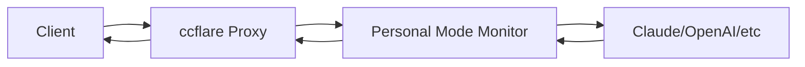

# Personal Mode LLM Monitor: Expansion Plan

## Current Session Management Analysis

### Current Implementation Issues
The existing session logic in [`personal_mode_llm_monitor.ts:80-97`](packages/personal-mode-monitor/src/personal_mode_llm_monitor.ts:80-97) uses simple time-based windows:

```typescript
// Current approach - too simplistic
private extractSessionId(request: Request): string {
  const timestamp = Math.floor(Date.now() / (5 * 60 * 1000)); // 5-minute windows
  return `session-${this.hashString(sessionData)}`;
}
```

**Problems:**
- No semantic understanding of conversation topics
- Can't handle multiple simultaneous conversations
- Loses context when conversations resume later
- No conversation thread identification

## Phase 1: Enhanced Session Management (Immediate - Lightweight)

### 1.1 Conversation Thread Detection
**Goal**: Identify conversation threads without embedding infrastructure

**Implementation Plan:**
```typescript
// New session detection logic
interface ConversationThread {
  threadId: string;
  topic: string; // extracted from first message
  lastActivity: number;
  messageCount: number;
  participants: string[];
}

class ThreadDetector {
  // Simple keyword-based topic extraction
  extractTopic(content: string): string {
    // Look for explicit topics: "help me with X", "I need to Y"
    // Extract nouns and action verbs
    // Maximum 50 chars topic summary
  }
  
  // Detect thread continuation
  isThreadContinuation(newMessage: string, existingThreads: ConversationThread[]): string | null {
    // Check for explicit references: "continuing from earlier", "back to the X topic"
    // Look for shared vocabulary/concepts
    // Check timing patterns (same user, reasonable gap)
  }
}
```

### 1.2 Database Schema Enhancement
**New Tables:**
```sql
CREATE TABLE conversation_threads (
  thread_id TEXT PRIMARY KEY,
  user_id TEXT NOT NULL,
  topic TEXT NOT NULL,
  created_at INTEGER NOT NULL,
  last_activity INTEGER NOT NULL,
  message_count INTEGER DEFAULT 0,
  status TEXT DEFAULT 'active' -- active, paused, closed
);

CREATE TABLE thread_messages (
  message_id TEXT PRIMARY KEY,
  thread_id TEXT NOT NULL,
  interaction_id TEXT NOT NULL, -- FK to personal_interactions
  sequence_order INTEGER NOT NULL,
  FOREIGN KEY (thread_id) REFERENCES conversation_threads(thread_id),
  FOREIGN KEY (interaction_id) REFERENCES personal_interactions(id)
);
```

### 1.3 Session Bridging Logic
```typescript
class SessionBridger {
  // Resume conversations after gaps
  findResumableThreads(userId: string, content: string): ConversationThread[] {
    // Look for threads paused in last 7 days with topic similarity
    // Check for explicit continuation signals
    // Score by topic relevance and timing
  }
  
  // Handle concurrent conversations
  detectConcurrentThreads(userId: string): ConversationThread[] {
    // Multiple active threads for same user
    // Different topics/contexts running simultaneously
  }
}
```

## Phase 2: Multi-Endpoint Capture Architecture

### 2.1 Current Architecture Analysis
The system works as a **proxy interceptor** - all traffic flows through ccflare proxy first:



### 2.2 OpenRouter Integration Plan

**Step 1: Provider Detection Enhancement**
```typescript
// Enhanced provider detection in integration.ts
class ProviderDetector {
  detectEndpoint(request: Request, url: URL): EndpointInfo {
    // Current: only anthropic.com
    // Add: openrouter.ai, openai.com, etc.
    
    if (url.hostname.includes('openrouter.ai')) {
      return {
        provider: 'openrouter',
        finalDestination: this.extractOpenRouterModel(request),
        apiType: 'chat-completions'
      };
    }
    
    if (url.hostname.includes('api.openai.com')) {
      return { provider: 'openai', finalDestination: 'openai-direct' };
    }
  }
  
  extractOpenRouterModel(request: Request): string {
    // Parse request body to get model (e.g., "anthropic/claude-3-sonnet")
    // Return actual model being used, not just "openrouter"
  }
}
```

**Step 2: New Database Fields**
```sql
ALTER TABLE personal_interactions ADD COLUMN provider TEXT DEFAULT 'claude';
ALTER TABLE personal_interactions ADD COLUMN endpoint_destination TEXT;
ALTER TABLE personal_interactions ADD COLUMN routing_path TEXT; -- openrouter -> anthropic/claude-3
```

**Step 3: Multi-Provider Request Tracking**
```typescript
interface EnhancedInteraction extends PersonalInteraction {
  provider: string; // 'claude', 'openrouter', 'openai'
  endpointDestination: string; // Final model/service
  routingPath: string; // How request was routed
  intermediateServices: string[]; // Any proxy chains
}
```

### 2.3 Universal LLM Capture System

**Configuration-Driven Approach:**
```typescript
interface ProviderConfig {
  name: string;
  hostPatterns: string[];
  pathPatterns: string[];
  modelExtractor: (request: Request) => string;
  tokenExtractor: (response: Response) => TokenUsage;
  costCalculator: (tokens: TokenUsage, model: string) => number;
}

const PROVIDER_CONFIGS: ProviderConfig[] = [
  {
    name: 'openrouter',
    hostPatterns: ['openrouter.ai'],
    pathPatterns: ['/api/v1/chat/completions'],
    modelExtractor: (req) => extractFromBody(req, 'model'),
    // ... more configs
  },
  // Add new providers by configuration
];
```

## Phase 3: Data Analysis & Storage Optimization

### 3.1 Content Analysis Pipeline
**Goal**: Extract insights and reduce storage without losing important information

```typescript
interface ConversationSummary {
  thread_id: string;
  summary: string; // AI-generated summary of key points
  topics: string[]; // Extracted topics/themes
  decisions_made: string[]; // Decisions or conclusions reached
  action_items: string[]; // Tasks or follow-ups identified
  code_changes: string[]; // Files/code discussed
  learning_insights: string[]; // New concepts learned
}

class ContentAnalyzer {
  // Periodic analysis (nightly?)
  async analyzeAndSummarize(threadId: string): Promise<ConversationSummary> {
    const messages = await this.getThreadMessages(threadId);
    
    // Use local LLM or lightweight analysis
    return {
      summary: await this.generateSummary(messages),
      topics: this.extractTopics(messages),
      decisions_made: this.extractDecisions(messages),
      action_items: this.extractActionItems(messages),
      code_changes: this.extractCodeReferences(messages),
      learning_insights: this.extractLearningMoments(messages)
    };
  }
}
```

### 3.2 Storage Lifecycle Management
```typescript
class StorageManager {
  // 3-tier storage approach
  
  // Tier 1: Hot storage (recent, frequently accessed)
  // - Full conversation content
  // - Last 30 days
  
  // Tier 2: Warm storage (summarized)
  // - Conversation summaries + key excerpts
  // - 30 days - 1 year
  
  // Tier 3: Cold storage (archives)
  // - High-level summaries only
  // - Key decisions and insights
  // - 1+ years
  
  async promoteToSummary(threadId: string) {
    const summary = await this.contentAnalyzer.analyzeAndSummarize(threadId);
    await this.archiveFullContent(threadId);
    await this.storeSummary(summary);
  }
}
```

### 3.3 Qdrant Integration (Future Phase)
**Preparation for Semantic Search:**
```typescript
interface QdrantConfig {
  enabled: boolean;
  endpoint: string;
  collection: string;
  embeddingModel: string; // e.g., 'all-MiniLM-L6-v2'
}

class SemanticSessionManager {
  // Vector-based conversation similarity
  async findSimilarConversations(content: string): Promise<ConversationThread[]> {
    // Generate embedding for new content
    // Search Qdrant for similar conversation vectors
    // Return ranked list of related threads
  }
  
  // Automatic conversation clustering
  async clusterConversations(userId: string): Promise<ConversationCluster[]> {
    // Group related conversations by semantic similarity
    // Identify recurring topics and patterns
  }
}
```

## Implementation Timeline & Priority

### Phase 1: Enhanced Session Management (Sprint 1-2)
- [ ] Implement conversation thread detection
- [ ] Add new database tables for threads
- [ ] Create session bridging logic
- [ ] Add topic extraction
- [ ] Test with multi-day conversations

### Phase 2: Multi-Endpoint Capture (Sprint 3-4)
- [ ] Add OpenRouter provider detection
- [ ] Enhance database schema for multi-provider
- [ ] Implement provider-agnostic request/response parsing
- [ ] Add routing path tracking
- [ ] Test with multiple simultaneous endpoints

### Phase 3: Data Analysis & Optimization (Sprint 5-6)
- [ ] Build content analysis pipeline
- [ ] Implement conversation summarization
- [ ] Add storage lifecycle management
- [ ] Create archive/retrieval system
- [ ] Prepare Qdrant integration hooks

### Critical Dependencies
1. **Thread Detection**: Requires enhanced content parsing
2. **Multi-Provider**: Needs provider configuration system
3. **Storage Optimization**: Depends on analysis capabilities
4. **Semantic Search**: Future integration with existing Qdrant setup

Would you like me to elaborate on any specific phase or adjust the priorities based on your immediate needs?
